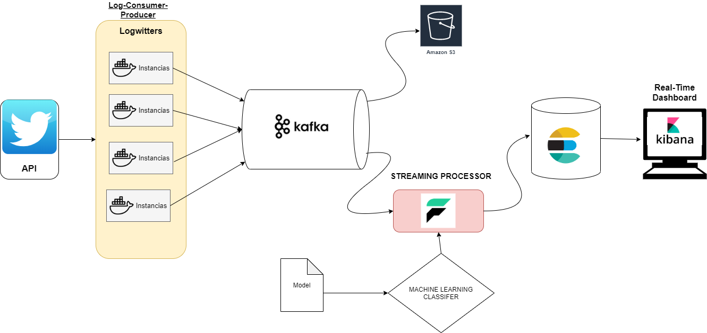

# Twitter - Streaming de Análise Sentimental

O Projeto abaixo trata de resolver o Teste da IBM, onde o objetivo é criar uma arquitetura distribuida, escalável para
analisar os textos - unbounded data - produzidos pelo Twitter (pt-br). O problema em questão se encontra na família de streaming
processing, onde os dados vindos de uma fonte que gera dados infinitos, sem padrão de tempo definido, ou seja unbounded data.

O Processamento de Streaming vem ganhando cada vez mais importancia, pois os metodos de ETL com batch processing engine já não são capazes de suportar a natureza dos dados em streaming. Para isso novas tecnologias e arquiteturas são formuladas para melhor atender a este novo cenario.

O que é Streaming data ?

--- <respodner>


- [x] Criar o Produtor para enviar os eventos para o Kafka
- [X] Configurar o Streaming Processor Faust
- [X] Desenvolver um modelo de Machine Learning e testar a acurácia 
- [X] Instalar e Configurar o ElasticSearch + Kibana (Cloud ou VM ou Docker - cuidado com dockers)
- [X] Conectar o Faust com Elasticsearch 
- [X] Desenvolver Dashboards em Real-Time e Canvas
- [ ] Integrar a aplicação - Produtor e Consumidor - em Docker Containers
- [X] Garantir Escalabilidade em Produtores e Consumidores
- [ ] Futuras contribuições - Apache Druid e instalar o Logstash + MetricBeats (Monitorar minha aplicação)


## Pre-requisitos

Os seguintes requisitos são necessários para rodar este projeto:

* Docker
* Python 3.7
* Kafka + Schema Registry + KSQL
* ELK
* Faust
* SkLearn
* Acesso a um computador de no minimo 16gb+ RAM e 4-core CPU.
* Acesso a um broker Kafka (VM no caso disponibilizada ou então um docker).
* Acesso ao servidor em cloud do ElasticSearch.


## Descrição

O Twitter é uma rede social onde os usuarios podem twettar (textos) sobre algo, alguém etc. Muitos twettes são ofensivos, outros são
textos de esperança e alegria e alguns são apenas informativos - neutros. O Twitter disponibiliza uma API onde desenvolvedores podem requisitar os twetts da plataforma - obedecendo certas regras. Os twetts são eventos - unbounded - gerados de forma infinita e sem uma dependência de tempo de geração. Para classificarmos os twettes em positivo, negativo e neutro é preciso tratar e formular uma arquitetura voltada a processamento de streaming e uma plataforma final para o usuario com alta velocidade de busca textual, e também não menos importante, é preciso de um algoritmo que classifique os twettes em suas respectivas classes. O tratamento de textos - strings- merece uma atenção especial, pois técnicas de Machine Learning são especiais para atender palavras. No presente projeto foi utilizado o algoritmo de Naive Bayes para classificar os twetts.

A Imagem a seguir representa a arquitetura utilizada:



### Passo 1: Instalar o Kafka/Zookeeper e Criar Topico:

Um docker-compose foi fornecido para instalar o Kafka e todas sua estrutura. Porém no caso, aconselho a usar o Kafka dedicado em uma VM
para se ter um aproveitamento melhor e controle fino sobre a JVM, Swap, GarbageCollect e I/O measurements. Foi fornecido tanto a versão
em docker como a VM que eu utilizei. Para instalar na Cloud o Kafka, requer uma VM com mais de 1GB, o que deixou meu projeto inviavel financeiramente para criar Brokers em Cloud.

Apache Kafka utiliza o Zookeeper (versões antigas) para armazenar o metadata do Kafka cluster, também
os consumer client details. Para Instalar o Zookeeper os pré-requisitos são:Java ->

```bash
sudo apt install openjdk-8-jdk
java -version
```

{VERSION} = zookeeper-3.4.14
{FILE} = zookeeper-3.4.14.tar.gz

```bash
sudo wget http://mirror.cc.columbia.edu/pub/software/apache/zookeeper/{VERSION}/{FILE}
#
tar -zxf {FILE}
mv zookeeper-3.4.6 /usr/local/zookeeper
mkdir -p /var/lib/zookeeper
cp  /usr/local/zookeeper/conf/zoo_sample.cfg  /usr/local/zookeeper/conf/zoo.cfg 
export JAVA_HOME={/usr/path/JAVA_VERSION}
```

Para um maior detalhamento do Zookeeper aconselho ler o Zookeeper da O'reilly, muito bom, melhor até que a documentação.

Com o Zookeeper, você pode instalar o Apache Kafka pelo site http://kafka.apache.org/downloads.html

```bash
tar -zxf kafka_2.{VERSION}.tgz
mv kafka_2.{VERSION} /usr/local/kafka
mkdir /tmp/kafka-logs
/usr/local/kafka/bin/kafka-server-start.sh -daemon
/usr/local/kafka/config/server.properties
```

Para os comandos iniciais do Kafka eu forneci alguns arquivos em Bash, na pasta de VirtualMachines

```bash
sudo ./start_server.sh or
sudo ./start_topics.sh
```

Topicos criados:

```bash
cd ~
sudo .\creat_topics eventcrud.twitter.json
sudo  /usr/local/kafka/bin/kafka-console-consumer.sh --topic eventcrud.twitter.json --bootstrap-server localhost:9092
```

Aconselho sempre a revisão detalhada na hora de criar topicos, não aconselho a sua automatização, é preciso muito estudo antes de sair
escolhendo as configs, faça testes de compressão e analise bem seu benchmarking, para melhorar sua performance saiba equilibrar:
* Brokes -> Replication -> Group Consumer -> Numero de Prod/Cons
